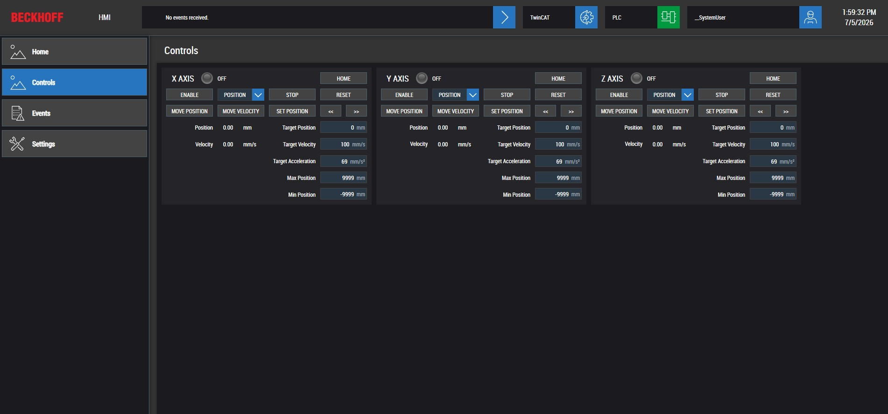

# TwinCAT Test Rack

A 3-axis motion control development platform built from scratch — real drives, encoder feedback, certified safety hardware, and a state machine that validates PLC motion code before it goes to production.

  

---

## Hardware

| Component | Part |
|-----------|------|
| Controller | Beckhoff IPC |
| Drives | Stepper drives — 3 axes |
| Feedback | Incremental encoders on each axis |
| Safety | TwinSAFE EL2911 — certified two-channel E-stop |
| I/O | EtherCAT terminal backplane |
| Operator Panel | 3 switches, green/orange/red status lights |

---

## How It Works

Press **sw1** to enable all axes. Press **sw2** to home. From there the HMI controls target moves. The safety PLC runs independently — on E-stop it cuts drive power in hardware and the standard PLC reacts to the output.

**Operator controls:**

| Input | Action |
|-------|--------|
| sw1 | Enable / disable all axes |
| sw2 | Home all axes to position 0 |
| sw3 | Reset drive faults and safety PLC |

---

## PLC Highlights

- State machine in MAIN — `OFF → ENABLED → HOMING → READY → ESTOP`
- Reusable `FB_MotorControl` wraps PLCopen into a single per-axis interface
- Safety logic isolated to TwinSAFE — standard PLC only reads the output
- All axes driven through a single array loop — scales with `CNUM_AXIS`

---

## Stack

`TwinCAT 3` · `IEC 61131-3 ST` · `PLCopen TC2_MC2` · `TwinSAFE` · `EtherCAT` · `TwinCAT HMI`
